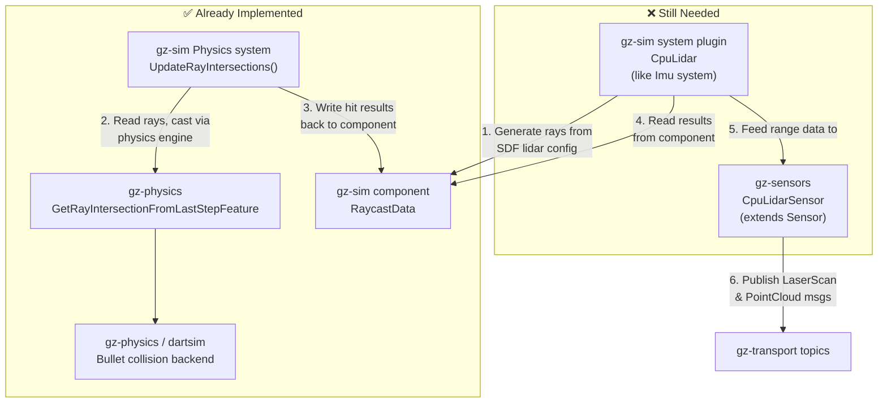
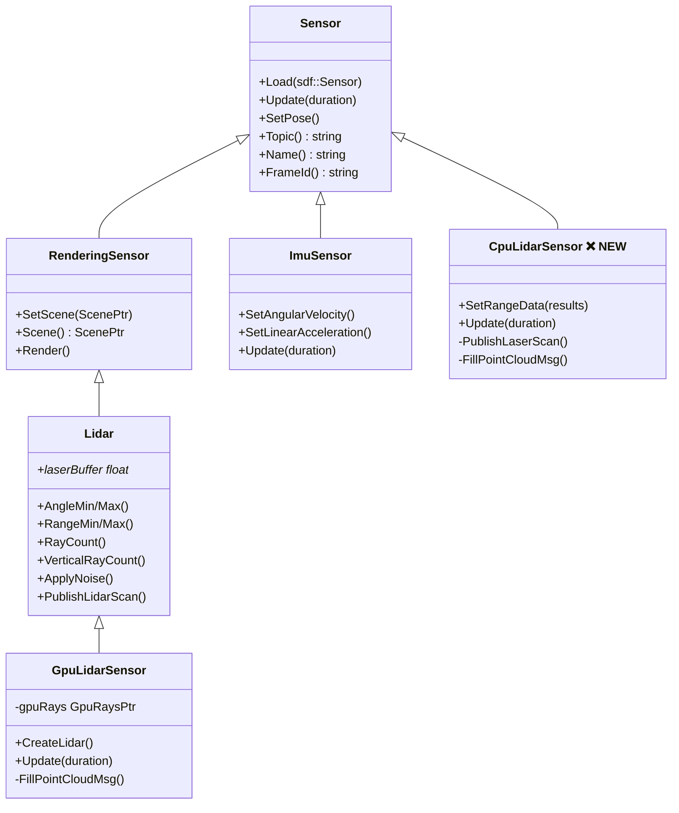
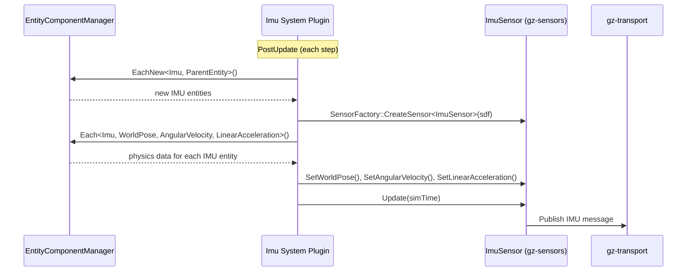
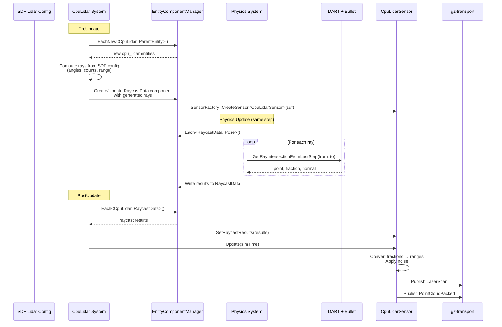

# CPU Lidar (No Rendering) — Codebase Analysis

**Issue**: [gz-sensors#26](https://github.com/gazebosim/gz-sensors/issues/26)
**Goal**: A physics-based lidar sensor that uses the collision engine for
raycasting instead of the GPU/rendering pipeline.

---

## 1. Motivation

The existing `GpuLidarSensor` requires a rendering engine (Ogre2) and a GPU.
This makes it unusable on headless cloud machines, VMs without GPU passthrough,
and environments where only collision geometry (not visuals) should be detected.

Gazebo Classic had a CPU-based `RaySensor` backed by the physics engine.
The new Gazebo architecture needs an equivalent.

---

## 2. Architecture Overview



---

## 3. What Already Exists

### 3.1 Physics-level ray intersection (gz-physics)

**Feature definition:**
`src/gz-physics/include/gz/physics/GetRayIntersection.hh`

```cpp
class GetRayIntersectionFromLastStepFeature
    : public virtual FeatureWithRequirements<ForwardStep>
{
  struct RayIntersectionT<PolicyT> {
    VectorType point;     // hit point (world coords)
    Scalar     fraction;  // fraction of ray length at hit
    VectorType normal;    // surface normal at hit (world coords)
  };

  // World-level API:
  RayIntersectionData GetRayIntersectionFromLastStep(
    const VectorType &_from, const VectorType &_to) const;
};
```

This takes a ray (start → end in world coordinates) and returns the first
intersection point, the fraction along the ray, and the surface normal.

**DART / Bullet implementation:**
`src/gz-physics/dartsim/src/SimulationFeatures.cc` (lines 202–239)

```cpp
SimulationFeatures::RayIntersection
SimulationFeatures::GetRayIntersectionFromLastStep(
    const Identity &_worldID,
    const LinearVector3d &_from,
    const LinearVector3d &_to) const
{
  auto *const world = this->ReferenceInterface<DartWorld>(_worldID);
  auto collisionDetector = world->getConstraintSolver()->getCollisionDetector();
  auto collisionGroup = world->getConstraintSolver()->getCollisionGroup().get();

  dart::collision::RaycastOption option;
  dart::collision::RaycastResult result;
  collisionDetector->raycast(collisionGroup, _from, _to, option, &result);

  // Returns hit data or NaN if no hit (REP-117)
  ...
}
```

> **Important constraint**: Raycast currently only works with the **Bullet**
> collision detector in DART. Other detectors (ODE, FCL) return NaN.
> The SDF world must specify `<collision_detector>bullet</collision_detector>`.

**Tests:**
`src/gz-physics/test/common_test/simulation_features.cc` (lines 1851–1900)

---

### 3.2 RaycastData ECM component (gz-sim)

**File:** `src/gz-sim/include/gz/sim/components/RaycastData.hh`

```cpp
struct RayInfo {
  gz::math::Vector3d start;  // ray start in entity frame
  gz::math::Vector3d end;    // ray end in entity frame
};

struct RaycastResultInfo {
  gz::math::Vector3d point;    // hit point in entity frame
  double             fraction; // fraction of ray length at hit
  gz::math::Vector3d normal;   // normal at hit in entity frame
};

struct RaycastDataInfo {
  std::vector<RayInfo>          rays;    // INPUT:  rays to cast
  std::vector<RaycastResultInfo> results; // OUTPUT: results per ray
};

using RaycastData = Component<RaycastDataInfo, class RaycastDataTag, ...>;
```

This is the bridge between the system plugin (which defines the rays) and the
Physics system (which performs the raycasts). The coordinate frame is
**entity-local** — the Physics system converts to/from world frame internally.

---

### 3.3 Physics system ray processing (gz-sim)

**File:** `src/gz-sim/src/systems/physics/Physics.cc`

The ray intersection feature list (line 555):
```cpp
using RayIntersectionFeatureList = physics::FeatureList<
    physics::GetRayIntersectionFromLastStepFeature>;
```

`UpdateRayIntersections()` (lines 4293–4381) runs every physics step:

1. Checks if any entity has a `RaycastData` component; returns early if not
2. Gets the physics world and casts it to `RayIntersectionFeatureList`
3. Iterates all `(RaycastData, Pose)` entity pairs
4. For each ray in `RaycastData::rays`:
   - Transforms ray from entity frame → world frame
   - Calls `GetRayIntersectionFromLastStep(from, to)`
   - Transforms hit point and normal back to entity frame
   - Stores result in `RaycastData::results`

Called from the main physics update loop (line 4110).

---

### 3.4 Existing sensor class hierarchy (gz-sensors)



**Key insight:** The existing `Lidar` class extends `RenderingSensor`, which
depends on `gz-rendering`. The new `CpuLidarSensor` must extend `Sensor`
directly to avoid the rendering dependency entirely.

This means `CpuLidarSensor` **cannot** reuse the `Lidar` base class and must
re-implement the SDF lidar parameter parsing, noise application, and message
publishing. However, much of this logic can be extracted or copied from:

- **SDF parsing & config**: `src/gz-sensors/src/Lidar.cc` `Load()` (lines 102–196)
- **Noise application**: `src/gz-sensors/src/Lidar.cc` `ApplyNoise()` (lines 223–238)
- **LaserScan publishing**: `src/gz-sensors/src/Lidar.cc` `PublishLidarScan()` (lines 242–305)
- **PointCloud publishing**: `src/gz-sensors/src/GpuLidarSensor.cc` `FillPointCloudMsg()` (lines 352–426)

---

### 3.5 Imu system — the pattern to follow (gz-sim)

**Files:**
- `src/gz-sim/src/systems/imu/Imu.hh`
- `src/gz-sim/src/systems/imu/Imu.cc`

The Imu system is the reference implementation for non-rendering sensor
systems. It implements `ISystemPreUpdate` + `ISystemPostUpdate`:



Key pattern:
1. **`CreateSensors()`** — discovers new sensor entities in the ECM, instantiates
   `gz-sensors` objects via `SensorFactory`
2. **`Update()`** — reads physics-computed components from ECM, feeds data into
   sensor objects
3. **`sensor->Update(simTime)`** — triggers internal sensor logic + message
   publishing
4. **`RemoveEntities()`** — cleans up sensors whose entities have been removed

---

## 4. What's Missing

### 4.1 `CpuLidarSensor` (gz-sensors)

A new sensor class that:

| Responsibility | Details |
|---|---|
| **Extends** | `gz::sensors::Sensor` (NOT `Lidar` / `RenderingSensor`) |
| **Loads** | SDF `<sensor type="cpu_lidar">` or similar |
| **Parses** | `sdf::Lidar` config (angles, ranges, ray counts, noise) |
| **Receives** | Range data from the system plugin (setter method) |
| **Applies** | Gaussian noise model (same as existing `Lidar::ApplyNoise()`) |
| **Publishes** | `gz::msgs::LaserScan` on `<topic>` |
| **Publishes** | `gz::msgs::PointCloudPacked` on `<topic>/points` |

**New files needed:**
- `src/gz-sensors/include/gz/sensors/CpuLidarSensor.hh`
- `src/gz-sensors/src/CpuLidarSensor.cc`
- CMake: new library target `gz-sensors-cpu-lidar` (following the pattern of
  `gz-sensors-gpu-lidar`, `gz-sensors-imu`, etc.)

**Public API sketch:**
```cpp
class CpuLidarSensor : public Sensor
{
  bool Load(const sdf::Sensor &_sdf) override;
  bool Update(const std::chrono::steady_clock::duration &_now) override;
  bool HasConnections() const override;

  // Called by the system plugin to feed physics raycast results
  void SetRaycastResults(
    const std::vector<gz::sim::components::RaycastResultInfo> &_results);

  // Lidar config accessors (parsed from SDF)
  gz::math::Angle AngleMin() const;
  gz::math::Angle AngleMax() const;
  double RangeMin() const;
  double RangeMax() const;
  unsigned int RayCount() const;
  unsigned int VerticalRayCount() const;
  // ... etc.
};
```

---

### 4.2 `CpuLidar` system plugin (gz-sim)

A new system plugin following the Imu pattern:

| Responsibility | Details |
|---|---|
| **Interfaces** | `ISystemPreUpdate` + `ISystemPostUpdate` |
| **Discovers** | entities with a `CpuLidar` component (new) |
| **Generates rays** | from the SDF lidar config (angles, ray count, range) |
| **Writes** | `RaycastData` component with the generated rays |
| **Reads** | `RaycastData` results (populated by Physics system) |
| **Feeds** | results into `CpuLidarSensor` |
| **Calls** | `sensor->Update(simTime)` to trigger publishing |

**New files needed:**
- `src/gz-sim/src/systems/cpu_lidar/CpuLidar.hh`
- `src/gz-sim/src/systems/cpu_lidar/CpuLidar.cc`
- `src/gz-sim/src/systems/cpu_lidar/CMakeLists.txt`
- New ECM component `src/gz-sim/include/gz/sim/components/CpuLidar.hh`
  (similar to `components/Imu.hh` — wraps `sdf::Sensor`)

**Data flow per simulation step:**



---

## 5. Ray Generation Logic

The system plugin must convert SDF lidar parameters into rays. Each ray is
defined by a start and end point in entity frame.

Given SDF parameters:
- `horizontal_scan`: `min_angle`, `max_angle`, `samples`
- `vertical_scan`: `min_angle`, `max_angle`, `samples`
- `range`: `min`, `max`

Ray generation (pseudocode):
```
for v_idx in 0..vertical_samples:
    inclination = v_min + v_idx * (v_max - v_min) / (vertical_samples - 1)
    for h_idx in 0..horizontal_samples:
        azimuth = h_min + h_idx * (h_max - h_min) / (horizontal_samples - 1)

        direction = Vector3d(
            cos(inclination) * cos(azimuth),
            cos(inclination) * sin(azimuth),
            sin(inclination)
        )

        ray.start = direction * range_min
        ray.end   = direction * range_max
```

The Physics system will transform these entity-frame rays into world frame,
perform the raycast, and transform results back.

---

## 6. Key Files Reference

### gz-physics (ray intersection backend)

| File | Description |
|---|---|
| `src/gz-physics/include/gz/physics/GetRayIntersection.hh` | Feature definition: `GetRayIntersectionFromLastStepFeature`, `RayIntersectionT` struct |
| `src/gz-physics/include/gz/physics/detail/GetRayIntersection.hh` | Template implementation |
| `src/gz-physics/dartsim/src/SimulationFeatures.hh` | DART plugin declaration |
| `src/gz-physics/dartsim/src/SimulationFeatures.cc` (L202–239) | DART implementation using `dart::collision::RaycastResult` (Bullet only) |
| `src/gz-physics/test/common_test/simulation_features.cc` (L1851–1900) | Integration test |

### gz-sim (ECM components + Physics system)

| File | Description |
|---|---|
| `src/gz-sim/include/gz/sim/components/RaycastData.hh` | `RayInfo`, `RaycastResultInfo`, `RaycastDataInfo` structs + component |
| `src/gz-sim/src/systems/physics/Physics.cc` (L4293–4381) | `UpdateRayIntersections()` — iterates `RaycastData` components, casts rays |
| `src/gz-sim/src/systems/physics/Physics.cc` (L555) | `RayIntersectionFeatureList` type alias |
| `src/gz-sim/src/systems/physics/Physics.cc` (L64) | Include of `GetRayIntersection.hh` |
| `src/gz-sim/src/systems/imu/Imu.hh` | **Reference**: non-rendering system plugin structure |
| `src/gz-sim/src/systems/imu/Imu.cc` | **Reference**: sensor creation, ECM data feeding, update loop |

### gz-sensors (existing lidar + sensor base)

| File | Description |
|---|---|
| `src/gz-sensors/include/gz/sensors/Sensor.hh` | Base class — `CpuLidarSensor` should extend this |
| `src/gz-sensors/include/gz/sensors/RenderingSensor.hh` | Rendering base — `CpuLidarSensor` must NOT extend this |
| `src/gz-sensors/include/gz/sensors/Lidar.hh` | Lidar base (extends `RenderingSensor`) — source of config accessors and publishing logic to replicate |
| `src/gz-sensors/src/Lidar.cc` (L102–196) | SDF lidar parsing, noise setup, `LaserScan` msg init |
| `src/gz-sensors/src/Lidar.cc` (L223–238) | `ApplyNoise()` — Gaussian noise on laser buffer |
| `src/gz-sensors/src/Lidar.cc` (L242–305) | `PublishLidarScan()` — publishes `gz::msgs::LaserScan` |
| `src/gz-sensors/include/gz/sensors/GpuLidarSensor.hh` | GPU implementation (extends `Lidar`) |
| `src/gz-sensors/src/GpuLidarSensor.cc` (L258–308) | `Update()` — render, apply noise, publish scan + point cloud |
| `src/gz-sensors/src/GpuLidarSensor.cc` (L352–426) | `FillPointCloudMsg()` — spherical→cartesian conversion for `PointCloudPacked` |

### gz-sim (GPU lidar system — for reference)

| File | Description |
|---|---|
| `src/gz-sim/src/systems/sensors/Sensors.cc` | General rendering-sensor system that handles `GpuLidarSensor` instantiation (L1140–1144) |

---

## 7. Constraints and Considerations

1. **Bullet collision detector required** — The DART raycast implementation only
   works with the Bullet backend. SDF worlds must include:
   ```xml
   <physics type="dart">
     <dart>
       <collision_detector>bullet</collision_detector>
     </dart>
   </physics>
   ```

2. **Collision shapes vs. visuals** — CPU lidar will detect collision geometry,
   not visual meshes. This is a fundamental behavioral difference from GPU lidar
   and should be documented for users.

3. **Performance** — Each ray requires a separate
   `GetRayIntersectionFromLastStep()` call. A 360° lidar with 1800 samples × 16
   vertical layers = 28,800 raycasts per step. Performance profiling will be
   needed.

4. **SDF sensor type** — Needs a new `sdf::SensorType` (e.g., `CPU_LIDAR`) or
   reuse of `LIDAR` type. This requires a change to
   [sdformat](https://github.com/gazebosim/sdformat).

5. **No rendering dependency** — The `CpuLidarSensor` library must not link
   against `gz-rendering`. It should be a standalone `gz-sensors-cpu-lidar`
   target.

---

## 8. Prior Work and References

- [gz-sensors#26](https://github.com/gazebosim/gz-sensors/issues/26) — Original feature request
- [gz-physics#641](https://github.com/gazebosim/gz-physics/pull/641) — Ray intersection feature PR
- [gz-sim#2514](https://github.com/gazebosim/gz-sim/pull/2514) — Physics system ray intersection integration
- [gz-sim#2759](https://github.com/gazebosim/gz-sim/pull/2759) — Backport to Harmonic
- @romulogcerqueira's [proposal](https://github.com/gazebosim/gz-sensors/issues/26#issuecomment-2095143488) — High-level implementation plan
- @chapulina's [original plan](https://github.com/gazebosim/gz-sensors/issues/26#issuecomment-827420019) — MultiRayShape approach (superseded)

---

## 9. Implementation Status

### Demonstration

The `cpu_lidar_demo` package in `ros_ws/src/cpu_lidar_demo/` provides a working demonstration of the CPU lidar sensor integrated with ROS 2. It supports decoupled GUI/Server mode, allowing the Gazebo simulation to run headlessly while the GUI and RViz connect remotely — ideal for testing CPU lidar behavior in CI/CD environments without graphics dependencies.

### Completed

| Component | Package | Status |
|---|---|---|
| `CpuLidarSensor` class | gz-sensors | ✅ Complete |
| SDF parameter parsing | gz-sensors | ✅ Complete |
| Ray generation | gz-sensors | ✅ Complete |
| Range computation | gz-sensors | ✅ Complete |
| Gaussian noise model | gz-sensors | ✅ Complete |
| LaserScan publishing | gz-sensors | ✅ Complete |
| PointCloudPacked publishing | gz-sensors | ✅ Complete |
| `CpuLidar` ECM component | gz-sim | ✅ Complete |
| `CpuLidar` system plugin | gz-sim | ✅ Complete |
| SdfEntityCreator integration | gz-sim | ✅ Complete |
| Physics raycasting pipeline | gz-sim | ✅ Already existed |
| Integration tests (gz-sensors) | gz-sensors | ✅ Complete |
| Integration tests (gz-sim) | gz-sim | ✅ Complete |
| Example world | gz-sim | ✅ Complete |

### Usage

To use the CPU lidar sensor in an SDF world:

1. Set the physics engine to DART with Bullet collision detector:
   ```xml
   <physics type="dart">
     <dart>
       <collision_detector>bullet</collision_detector>
     </dart>
   </physics>
   ```

2. Load the required system plugins:
   ```xml
   <plugin filename="gz-sim-physics-system"
           name="gz::sim::systems::Physics"/>
   <plugin filename="gz-sim-cpu-lidar-system"
           name="gz::sim::systems::CpuLidar"/>
   ```

3. Add a sensor with `type="lidar"` to a link:
   ```xml
   <sensor name="my_lidar" type="lidar">
     <topic>/lidar</topic>
     <update_rate>10</update_rate>
     <ray>
       <scan>
         <horizontal>
           <samples>640</samples>
           <min_angle>-1.57</min_angle>
           <max_angle>1.57</max_angle>
         </horizontal>
       </scan>
       <range>
         <min>0.08</min>
         <max>10.0</max>
       </range>
     </ray>
   </sensor>
   ```

4. The sensor publishes:
   - `gz::msgs::LaserScan` on `<topic>`
   - `gz::msgs::PointCloudPacked` on `<topic>/points`

### API Reference

#### CpuLidarSensor (gz-sensors)

```cpp
class CpuLidarSensor : public Sensor
{
  bool Load(const sdf::Sensor &_sdf) override;
  bool Update(const std::chrono::steady_clock::duration &_now) override;
  bool HasConnections() const override;

  // Ray generation from SDF config
  std::vector<std::pair<Vector3d, Vector3d>> GenerateRays() const;

  // Feed physics results (called by system plugin)
  void SetRaycastResults(const std::vector<RayResult> &_results);

  // Read computed ranges
  void Ranges(std::vector<double> &_ranges) const;

  // SDF config accessors
  Angle AngleMin() const;
  Angle AngleMax() const;
  Angle VerticalAngleMin() const;
  Angle VerticalAngleMax() const;
  double RangeMin() const;
  double RangeMax() const;
  unsigned int RayCount() const;
  unsigned int VerticalRayCount() const;
};
```
