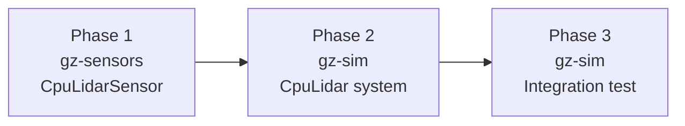
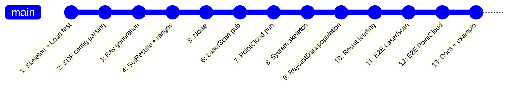

# CPU Lidar — Test-Driven Development Plan

A fully incremental, test-first development workflow for implementing
[gz-sensors#26](https://github.com/gazebosim/gz-sensors/issues/26).

---

## Development Environment

All work happens inside the Docker container. Typical session:

```bash
./dev.bash up
./dev.bash shell

# Inside container:
colcon build --merge-install --packages-select <pkg> --cmake-args '-DBUILD_TESTING=ON'
colcon test --packages-select <pkg> --ctest-args -R <test_name>
colcon test-result --verbose
```

---

## Phased Approach

The implementation spans three packages. Each phase is self-contained and
produces a working, tested artifact before moving to the next.



---

## Phase 1: `CpuLidarSensor` in gz-sensors

This sensor class has no rendering dependency. It receives raycast results
from the system plugin, applies noise, and publishes messages. It can be
fully tested in isolation (no physics, no rendering).

Reference patterns:
- `src/gz-sensors/src/ImuSensor.cc` — non-rendering sensor
- `src/gz-sensors/test/integration/imu.cc` — test structure
- `src/gz-sensors/src/Lidar.cc` — SDF parsing, noise, publishing logic

### Files to create

```
src/gz-sensors/
├── include/gz/sensors/CpuLidarSensor.hh
├── src/CpuLidarSensor.cc
└── test/integration/cpu_lidar_sensor.cc
```

### Files to modify

```
src/gz-sensors/
├── src/CMakeLists.txt               # add cpu_lidar component
└── test/integration/CMakeLists.txt  # add cpu_lidar_sensor test
```

---

### Commit 1: Skeleton + Load test (RED → GREEN)

**Test first** — `test/integration/cpu_lidar_sensor.cc`:

```cpp
// Helper to build SDF for a cpu_lidar sensor (reuse pattern from gpu_lidar test)
sdf::ElementPtr CpuLidarToSdf(const std::string &name, ...);

TEST_F(CpuLidarSensorTest, CreateSensor)
{
  // Create SDF with type="cpu_lidar" (or "lidar")
  auto sdf = CpuLidarToSdf("test_cpu_lidar", ...);

  gz::sensors::SensorFactory sf;
  auto sensor = sf.CreateSensor<gz::sensors::CpuLidarSensor>(sdf);
  ASSERT_NE(nullptr, sensor);

  EXPECT_EQ("test_cpu_lidar", sensor->Name());
  EXPECT_EQ("/cpu_lidar", sensor->Topic());
  EXPECT_DOUBLE_EQ(10.0, sensor->UpdateRate());
}
```

**Then implement** — minimal `CpuLidarSensor` class:

- Extends `gz::sensors::Sensor`
- `Load(const sdf::Sensor &_sdf)` parses name/topic/rate
- Register with `SensorFactory`

**CMake**: add `gz_add_component(cpu_lidar ...)` in `src/CMakeLists.txt`,
NO dependency on rendering.

**Build & verify**:
```bash
colcon build --merge-install --packages-select gz-sensors10 \
  --cmake-args '-DBUILD_TESTING=ON'
colcon test --packages-select gz-sensors10 \
  --ctest-args -R INTEGRATION_cpu_lidar_sensor
```

```
git add -A && git commit -m "gz-sensors: CpuLidarSensor skeleton + creation test"
```

---

### Commit 2: SDF lidar parameter parsing (RED → GREEN)

**Test**:

```cpp
TEST_F(CpuLidarSensorTest, LidarConfig)
{
  auto sdf = CpuLidarToSdf("test", ...,
    /* horzSamples */ 640, /* horzMinAngle */ -1.396, /* horzMaxAngle */ 1.396,
    /* vertSamples */ 16, /* vertMinAngle */ -0.26, /* vertMaxAngle */ 0.26,
    /* rangeMin */ 0.08, /* rangeMax */ 10.0, ...);

  auto sensor = factory.CreateSensor<CpuLidarSensor>(sdf);
  ASSERT_NE(nullptr, sensor);

  EXPECT_EQ(640u, sensor->RayCount());
  EXPECT_EQ(16u, sensor->VerticalRayCount());
  EXPECT_NEAR(-1.396, sensor->AngleMin().Radian(), 1e-6);
  EXPECT_NEAR(1.396, sensor->AngleMax().Radian(), 1e-6);
  EXPECT_NEAR(-0.26, sensor->VerticalAngleMin().Radian(), 1e-6);
  EXPECT_NEAR(0.26, sensor->VerticalAngleMax().Radian(), 1e-6);
  EXPECT_DOUBLE_EQ(0.08, sensor->RangeMin());
  EXPECT_DOUBLE_EQ(10.0, sensor->RangeMax());
}
```

**Implement**: Parse `sdf::Lidar` in `Load()`, store in private data,
expose accessors. Logic extracted from `Lidar.cc` L102–196 but without
the `RenderingSensor` base class dependency.

```
git commit -m "gz-sensors: CpuLidarSensor SDF lidar config parsing"
```

---

### Commit 3: Ray generation (RED → GREEN)

**Test**:

```cpp
TEST_F(CpuLidarSensorTest, GenerateRays)
{
  // Simple case: 1 vertical layer, 3 horizontal samples, 180° FOV
  auto sdf = CpuLidarToSdf("test", ...,
    /* horzSamples */ 3, /* horzMinAngle */ -M_PI/2, /* horzMaxAngle */ M_PI/2,
    /* vertSamples */ 1, /* vertMinAngle */ 0, /* vertMaxAngle */ 0,
    /* rangeMin */ 0.1, /* rangeMax */ 5.0, ...);

  auto sensor = factory.CreateSensor<CpuLidarSensor>(sdf);
  auto rays = sensor->GenerateRays();

  ASSERT_EQ(3u, rays.size());

  // Ray 0: azimuth = -π/2 → direction = (0, -1, 0)
  EXPECT_NEAR(0.0, rays[0].start.X(), 1e-6);
  EXPECT_NEAR(-0.1, rays[0].start.Y(), 1e-6);
  EXPECT_NEAR(0.0, rays[0].end.X(), 1e-6);
  EXPECT_NEAR(-5.0, rays[0].end.Y(), 1e-6);

  // Ray 1: azimuth = 0 → direction = (1, 0, 0)
  EXPECT_NEAR(0.1, rays[1].start.X(), 1e-6);
  EXPECT_NEAR(5.0, rays[1].end.X(), 1e-6);

  // Ray 2: azimuth = π/2 → direction = (0, 1, 0)
  EXPECT_NEAR(0.1, rays[2].start.Y(), 1e-6);
  EXPECT_NEAR(5.0, rays[2].end.Y(), 1e-6);
}

TEST_F(CpuLidarSensorTest, GenerateRaysMultiLayer)
{
  // 2 vertical layers × 2 horizontal samples = 4 rays
  auto sdf = CpuLidarToSdf("test", ...,
    /* horzSamples */ 2, ..., /* vertSamples */ 2, ...);

  auto sensor = factory.CreateSensor<CpuLidarSensor>(sdf);
  auto rays = sensor->GenerateRays();
  ASSERT_EQ(4u, rays.size());

  // Verify each ray starts at range_min and ends at range_max
  for (const auto &ray : rays) {
    EXPECT_NEAR(0.1, ray.start.Length(), 1e-6);
    EXPECT_NEAR(5.0, ray.end.Length(), 1e-6);
  }
}
```

**Implement**: `GenerateRays()` method that converts the SDF lidar config
(angles, ray counts, range min/max) into a vector of `(start, end)` pairs
in entity frame. This will be called by the system plugin to populate
`RaycastData`.

```
git commit -m "gz-sensors: CpuLidarSensor ray generation from SDF config"
```

---

### Commit 4: Set results + range computation (RED → GREEN)

**Test**:

```cpp
TEST_F(CpuLidarSensorTest, SetRaycastResults)
{
  // 3 horizontal rays, range_min=0.1, range_max=5.0
  auto sensor = createSimpleSensor(3, 1);
  auto rays = sensor->GenerateRays();

  // Simulate physics results
  std::vector<CpuLidarSensor::RayResult> results(3);

  // Ray 0: hit at fraction 0.5 → range = 0.5 * 5.0 = 2.5
  results[0].fraction = 0.5;
  results[0].point = rays[0].start + 0.5 * (rays[0].end - rays[0].start);

  // Ray 1: no hit (NaN)
  results[1].fraction = std::numeric_limits<double>::quiet_NaN();
  results[1].point = {NAN, NAN, NAN};

  // Ray 2: hit at fraction 0.02 → range = 0.02 * 5.0 = 0.1 (at range_min)
  results[2].fraction = 0.02;
  results[2].point = rays[2].start + 0.02 * (rays[2].end - rays[2].start);

  sensor->SetRaycastResults(results);

  std::vector<double> ranges;
  sensor->Ranges(ranges);

  ASSERT_EQ(3u, ranges.size());
  EXPECT_NEAR(2.5, ranges[0], 1e-4);
  EXPECT_TRUE(std::isinf(ranges[1]));  // no hit → +inf (REP-117)
  EXPECT_NEAR(0.1, ranges[2], 1e-4);
}
```

**Implement**: `SetRaycastResults()` converts hit fractions to ranges,
clamps to `[range_min, range_max]`, sets no-hit to `+inf` per REP-117.
Populates internal `laserBuffer`.

```
git commit -m "gz-sensors: CpuLidarSensor SetRaycastResults + range computation"
```

---

### Commit 5: Noise application (RED → GREEN)

**Test**:

```cpp
TEST_F(CpuLidarSensorTest, GaussianNoise)
{
  // SDF with noise: mean=0, stddev=0.01
  auto sdf = CpuLidarToSdfWithNoise("test", ..., /* noiseMean */ 0.0,
                                     /* noiseStddev */ 0.01);

  auto sensor = factory.CreateSensor<CpuLidarSensor>(sdf);

  // Feed identical results many times, check range distribution
  std::vector<double> allRanges;
  for (int i = 0; i < 1000; ++i) {
    sensor->SetRaycastResults(identicalHitsAt2m);
    sensor->Update(time);
    std::vector<double> ranges;
    sensor->Ranges(ranges);
    allRanges.push_back(ranges[0]);
  }

  // Mean should be near 2.0, stddev near 0.01
  double mean = std::accumulate(allRanges.begin(), allRanges.end(), 0.0)
                / allRanges.size();
  EXPECT_NEAR(2.0, mean, 0.005);

  // Should NOT all be identical (noise is applied)
  bool allSame = std::all_of(allRanges.begin(), allRanges.end(),
    [&](double r){ return std::abs(r - allRanges[0]) < 1e-10; });
  EXPECT_FALSE(allSame);
}
```

**Implement**: Reuse `NoiseFactory::NewNoiseModel()` from existing code.
Apply in `Update()` before publishing. Logic from `Lidar.cc` `ApplyNoise()`.

```
git commit -m "gz-sensors: CpuLidarSensor Gaussian noise support"
```

---

### Commit 6: LaserScan message publishing (RED → GREEN)

**Test**:

```cpp
TEST_F(CpuLidarSensorTest, PublishLaserScan)
{
  auto sensor = createSimpleSensor(3, 1, "/test/cpu_lidar");

  // Subscribe to LaserScan
  gz::transport::Node node;
  std::vector<gz::msgs::LaserScan> received;
  node.Subscribe("/test/cpu_lidar", [&](const gz::msgs::LaserScan &_msg) {
    received.push_back(_msg);
  });

  EXPECT_TRUE(sensor->HasConnections());

  // Feed results and update
  sensor->SetRaycastResults(hitsAt2m);
  sensor->Update(std::chrono::milliseconds(100));

  // Wait for message
  WaitForMsg(received, 1);

  ASSERT_EQ(1u, received.size());
  auto &msg = received[0];
  EXPECT_EQ(3, msg.count());
  EXPECT_NEAR(-M_PI/2, msg.angle_min(), 1e-4);
  EXPECT_NEAR(M_PI/2, msg.angle_max(), 1e-4);
  EXPECT_EQ(3, msg.ranges_size());
  EXPECT_NEAR(2.0, msg.ranges(0), 1e-4);
}
```

**Implement**: `PublishLidarScan()` method, closely following
`Lidar.cc` L242–305. Advertise `gz::msgs::LaserScan` on `topic`.

```
git commit -m "gz-sensors: CpuLidarSensor LaserScan message publishing"
```

---

### Commit 7: PointCloud message publishing (RED → GREEN)

**Test**:

```cpp
TEST_F(CpuLidarSensorTest, PublishPointCloud)
{
  auto sensor = createSimpleSensor(3, 1, "/test/cpu_lidar");

  // Subscribe to PointCloudPacked on <topic>/points
  gz::transport::Node node;
  std::vector<gz::msgs::PointCloudPacked> received;
  node.Subscribe("/test/cpu_lidar/points",
    [&](const gz::msgs::PointCloudPacked &_msg) {
      received.push_back(_msg);
    });

  sensor->SetRaycastResults(hitsAt2m);
  sensor->Update(std::chrono::milliseconds(100));

  WaitForMsg(received, 1);

  ASSERT_EQ(1u, received.size());
  auto &msg = received[0];
  EXPECT_EQ(3u, msg.width());
  EXPECT_EQ(1u, msg.height());

  // Verify XYZ fields exist
  EXPECT_EQ("x", msg.field(0).name());
  EXPECT_EQ("y", msg.field(1).name());
  EXPECT_EQ("z", msg.field(2).name());
}
```

**Implement**: `FillPointCloudMsg()` with spherical→cartesian conversion.
Logic from `GpuLidarSensor.cc` L352–426.

```
git commit -m "gz-sensors: CpuLidarSensor PointCloud message publishing"
```

---

## Phase 2: `CpuLidar` system plugin in gz-sim

This system bridges the ECM (where the Physics system writes raycast
results) with the `CpuLidarSensor` (which publishes messages).

Reference patterns:
- `src/gz-sim/src/systems/imu/Imu.cc` — non-rendering system plugin
- `src/gz-sim/test/integration/imu_system.cc` — integration test with Server
- `src/gz-sim/test/worlds/imu.sdf` — test world

### Files to create

```
src/gz-sim/
├── src/systems/cpu_lidar/
│   ├── CpuLidar.hh
│   ├── CpuLidar.cc
│   └── CMakeLists.txt
├── include/gz/sim/components/CpuLidar.hh
├── test/worlds/cpu_lidar.sdf
└── test/integration/cpu_lidar_system.cc
```

### Files to modify

```
src/gz-sim/
├── src/systems/CMakeLists.txt            # add cpu_lidar subdirectory
└── test/integration/CMakeLists.txt       # add cpu_lidar_system test
```

---

### Commit 8: ECM component + system skeleton (RED → GREEN)

**Test** — `test/integration/cpu_lidar_system.cc`:

```cpp
TEST_F(CpuLidarTest, SensorEntityCreated)
{
  ServerConfig serverConfig;
  serverConfig.SetSdfFile(
    std::string(PROJECT_SOURCE_PATH) + "/test/worlds/cpu_lidar.sdf");

  Server server(serverConfig);

  // Relay to check component creation
  test::Relay testSystem;
  bool sensorFound = false;
  testSystem.OnPostUpdate([&](const UpdateInfo &,
                              const EntityComponentManager &_ecm)
  {
    _ecm.Each<components::CpuLidar, components::Name>(
      [&](const Entity &, const components::CpuLidar *,
          const components::Name *_name) -> bool
      {
        sensorFound = true;
        EXPECT_EQ("cpu_lidar_sensor", _name->Data());
        return true;
      });
  });

  server.AddSystem(testSystem.systemPtr);
  server.Run(true, 10, false);

  EXPECT_TRUE(sensorFound);
}
```

**Test world** — `test/worlds/cpu_lidar.sdf`:

```xml
<?xml version="1.0" ?>
<sdf version="1.9">
  <world name="cpu_lidar_test">
    <physics type="dart">
      <dart>
        <collision_detector>bullet</collision_detector>
      </dart>
    </physics>
    <plugin name="gz::sim::systems::Physics" filename="gz-sim-physics-system"/>
    <plugin name="gz::sim::systems::CpuLidar" filename="gz-sim-cpu-lidar-system"/>

    <model name="ground_plane">
      <static>true</static>
      <link name="link">
        <collision name="collision">
          <geometry><plane><normal>0 0 1</normal></plane></geometry>
        </collision>
      </link>
    </model>

    <model name="sensor_model">
      <pose>0 0 1 0 0 0</pose>
      <link name="link">
        <sensor name="cpu_lidar_sensor" type="cpu_lidar">
          <update_rate>10</update_rate>
          <topic>/test/cpu_lidar</topic>
          <ray>
            <scan>
              <horizontal>
                <samples>640</samples>
                <resolution>1</resolution>
                <min_angle>-1.396</min_angle>
                <max_angle>1.396</max_angle>
              </horizontal>
            </scan>
            <range>
              <min>0.08</min>
              <max>10.0</max>
            </range>
          </ray>
        </sensor>
      </link>
    </model>
  </world>
</sdf>
```

**Implement**:
- `components/CpuLidar.hh` — wraps `sdf::Sensor` (same pattern as
  `components/Imu.hh`)
- `CpuLidar` system — discovers entities, creates `CpuLidarSensor` via factory

```
git commit -m "gz-sim: CpuLidar component + system skeleton with entity discovery"
```

---

### Commit 9: RaycastData population (RED → GREEN)

**Test**:

```cpp
TEST_F(CpuLidarTest, RaycastDataPopulated)
{
  // ... server setup with cpu_lidar.sdf ...

  test::Relay testSystem;
  bool raycastDataFound = false;
  testSystem.OnPostUpdate([&](const UpdateInfo &_info,
                              const EntityComponentManager &_ecm)
  {
    if (_info.iterations < 3) return;  // let system initialize

    _ecm.Each<components::CpuLidar, components::RaycastData>(
      [&](const Entity &,
          const components::CpuLidar *,
          const components::RaycastData *_rayData) -> bool
      {
        raycastDataFound = true;
        // Verify rays were generated
        EXPECT_EQ(640u, _rayData->Data().rays.size());

        // Each ray should have non-zero length
        for (const auto &ray : _rayData->Data().rays) {
          EXPECT_GT((ray.end - ray.start).Length(), 0.0);
        }
        return true;
      });
  });

  server.AddSystem(testSystem.systemPtr);
  server.Run(true, 10, false);
  EXPECT_TRUE(raycastDataFound);
}
```

**Implement**: In `PreUpdate`, the system:
1. Calls `sensor->GenerateRays()` on newly created sensors
2. Creates/updates `RaycastData` component with those rays

The Physics system's existing `UpdateRayIntersections()` will automatically
process these rays — no changes needed to Physics.

```
git commit -m "gz-sim: CpuLidar system populates RaycastData with generated rays"
```

---

### Commit 10: Result feeding + sensor update (RED → GREEN)

**Test**:

```cpp
TEST_F(CpuLidarTest, RaycastResultsProcessed)
{
  // ... server setup ...

  test::Relay testSystem;
  bool resultsFound = false;
  testSystem.OnPostUpdate([&](const UpdateInfo &_info,
                              const EntityComponentManager &_ecm)
  {
    if (_info.iterations < 5) return;

    _ecm.Each<components::CpuLidar, components::RaycastData>(
      [&](const Entity &,
          const components::CpuLidar *,
          const components::RaycastData *_rayData) -> bool
      {
        // After a few steps, results should be populated by Physics
        if (!_rayData->Data().results.empty()) {
          resultsFound = true;
          EXPECT_EQ(_rayData->Data().rays.size(),
                    _rayData->Data().results.size());
        }
        return true;
      });
  });

  server.AddSystem(testSystem.systemPtr);
  server.Run(true, 20, false);
  EXPECT_TRUE(resultsFound);
}
```

**Implement**: In `PostUpdate`, the system:
1. Reads `RaycastData` results (populated by Physics)
2. Feeds them to `CpuLidarSensor::SetRaycastResults()`
3. Calls `sensor->Update(simTime)`

```
git commit -m "gz-sim: CpuLidar system feeds physics results to sensor"
```

---

## Phase 3: End-to-End Integration

### Commit 11: Full pipeline — LaserScan over gz-transport (RED → GREEN)

**Test**:

```cpp
TEST_F(CpuLidarTest, LaserScanPublished)
{
  // World: sensor 1m above ground plane
  // Expected: downward-facing rays should detect ground at ~1m

  ServerConfig serverConfig;
  serverConfig.SetSdfFile(...);  // cpu_lidar.sdf with ground plane

  Server server(serverConfig);

  gz::transport::Node node;
  std::vector<gz::msgs::LaserScan> received;
  node.Subscribe("/test/cpu_lidar",
    [&](const gz::msgs::LaserScan &_msg) {
      std::lock_guard<std::mutex> lock(mutex);
      received.push_back(_msg);
    });

  server.Run(true, 200, false);

  // Should have received at least one scan
  std::lock_guard<std::mutex> lock(mutex);
  ASSERT_GT(received.size(), 0u);

  auto &scan = received.back();
  EXPECT_EQ(640, scan.count());
  EXPECT_DOUBLE_EQ(0.08, scan.range_min());
  EXPECT_DOUBLE_EQ(10.0, scan.range_max());

  // At least some rays should have hit the ground plane
  bool anyHit = false;
  for (int i = 0; i < scan.ranges_size(); ++i) {
    if (!std::isinf(scan.ranges(i)) && !std::isnan(scan.ranges(i))) {
      anyHit = true;
      // Ground is 1m below sensor, range should be near 1m
      // (exact value depends on ray angle)
      EXPECT_GT(scan.ranges(i), 0.08);
      EXPECT_LT(scan.ranges(i), 10.0);
    }
  }
  EXPECT_TRUE(anyHit);
}
```

```
git commit -m "gz-sim: CpuLidar end-to-end integration test with LaserScan"
```

---

### Commit 12: PointCloud + collision-shape detection (RED → GREEN)

**Test**:

```cpp
TEST_F(CpuLidarTest, DetectsCollisionNotVisual)
{
  // World with a model that has:
  //   - visual: large sphere (radius=5)
  //   - collision: small box (0.5m)
  // CPU lidar should detect the collision box, not the visual sphere

  // ... server setup with special test world ...

  // Subscribe to point cloud
  // Verify detected distance matches collision shape, not visual
}

TEST_F(CpuLidarTest, PointCloudPublished)
{
  // Verify /test/cpu_lidar/points receives valid PointCloudPacked
  // with xyz + intensity + ring fields
}
```

```
git commit -m "gz-sim: CpuLidar PointCloud publishing + collision shape tests"
```

---

### Commit 13: Example world + documentation

- `src/gz-sim/examples/worlds/cpu_lidar_sensor.sdf` — demo world
- Update `docs/cpu-lidar-analysis.md` with final API docs

```
git commit -m "docs: CpuLidar example world and documentation"
```

---

## Commit Dependency Graph



---

## Build & Test Commands

```bash
# Phase 1 — gz-sensors only (fast iteration)
colcon build --merge-install --packages-select gz-sensors10 \
  --cmake-args '-DBUILD_TESTING=ON'
colcon test --packages-select gz-sensors10 \
  --ctest-args -R INTEGRATION_cpu_lidar
colcon test-result --verbose

# Phase 2 — gz-sim (requires gz-sensors already built)
colcon build --merge-install --packages-up-to gz-sim10 \
  --cmake-args '-DBUILD_TESTING=ON'
colcon test --packages-select gz-sim10 \
  --ctest-args -R INTEGRATION_cpu_lidar
colcon test-result --verbose

# Run a specific test by name
colcon test --packages-select gz-sensors10 \
  --ctest-args -R CpuLidarSensorTest.CreateSensor

# Run all tests for both packages
colcon test --packages-select gz-sensors10 gz-sim10 \
  --ctest-args -R cpu_lidar
```

---

## TDD Rhythm Checklist

For each commit:

1. **RED** — Write the test. Run it. Confirm it fails (compile error or assertion).
2. **GREEN** — Write the minimum code to make the test pass.
3. **REFACTOR** — Clean up duplication, extract helpers, improve naming.
4. **BUILD** — `colcon build` the relevant package.
5. **TEST** — `colcon test` the specific test. Verify GREEN.
6. **REGRESS** — Run all existing tests for the package. No regressions.
7. **COMMIT** — Small, focused commit with a clear message.

---

## Open Questions

| Question | Impact | Decision point |
|---|---|---|
| SDF sensor type string: `"cpu_lidar"` vs `"lidar"` vs `"ray"` | Requires sdformat change if new type | Before commit 1 |
| Should `CpuLidarSensor::GenerateRays()` live in the sensor or the system? | Affects API boundary | Commit 3 |
| Bullet collision detector: error or warning if not configured? | UX | Commit 10 |
| Reuse `Lidar` base class via refactor (extract non-rendering base)? | Scope creep vs. code reuse | After initial implementation |
